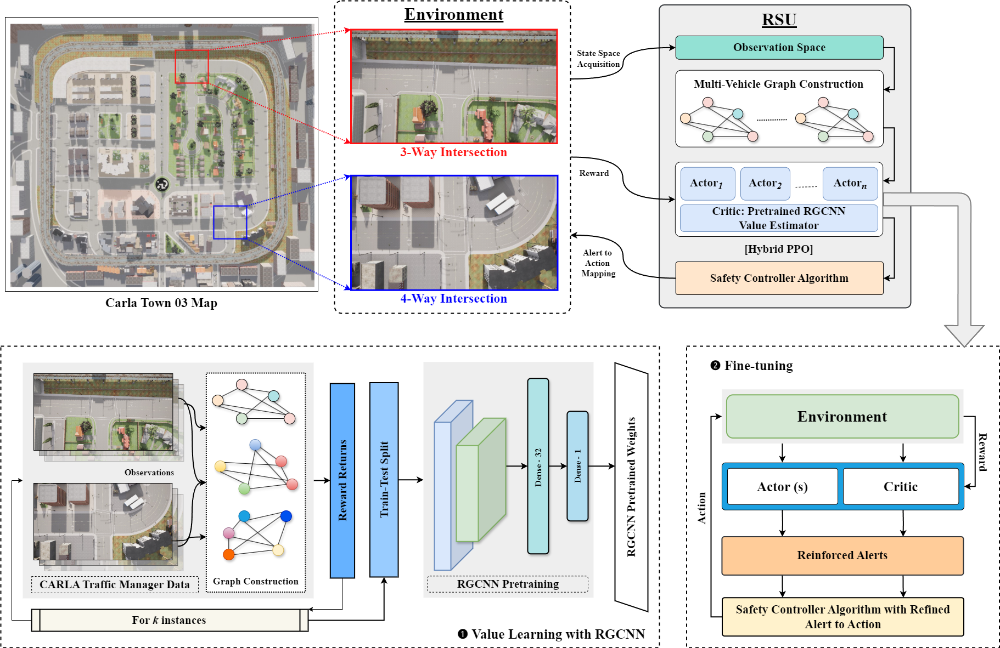

# Cooperative and Conflict-Aware Alerting using Graph-Based Reinforcement Learning in Rural Intersections for CAVs



This repository contains the code for the paper a conflict-aware intersection alerting framework for Connected and Automated Vehicles (CAVs). The proposed method combines Relational Graph Convolutional Networks (RGCNs) with Hybrid Proximal Policy Optimization (HPPO) to generate context-aware alerts at unsignalized rural intersections in CARLA.

The framework models vehicles as graph nodes with spatial and kinematic features, while multi-relational edges capture proximity, geometric conflict, and time-to-collision interactions. A PPO-based controller and a safety layer work together to reduce collisions, prevent deadlocks, and improve traffic flow across heterogeneous vehicle types.

## Key Results

- Collision rate reduced from 56.75% to 2% in 3-way intersections.
- Collision rate reduced from 37.5% to 22.62% in 4-way intersections.
- Queue reduction up to 1.28%.
- Average speed improvement up to 4.92 m/s.

## CARLA Setup

- Simulator: CARLA <0.9.16>
- Maps used:
  - Town03 for training and main evaluation
  - Town07 for additional evaluation
- Traffic Manager is used for vehicle spawning and control.

## Repository Structure

```text
repo-root/
  README.md
  LICENSE
  .gitignore

  src/
    setup/
      town03/
      town07/
    data_construction/
      town03/
      town07/
    value_pretraining/
      town03/
      town07/
    rl_fine_tuning/
      town03/
      town07/
    hybrid_rl/
      town03/
      town07/
    baselines/
    utils/

  models/
  graphs.rar
  blockdiagram.png
```

## What Each Folder Contains

- `src/setup/`
  - CARLA intersection setup scripts for Town03 and Town07.
- `src/data_construction/`
  - Scripts used to generate training and evaluation data.
- `src/value_pretraining/`
  - Value pretraining scripts and notebooks for critic initialization.
- `src/rl_fine_tuning/`
  - PPO fine-tuning scripts for the learned policy.
- `src/hybrid_rl/`
  - Hybrid RL scripts that combine learned policies with safety-aware control.
- `src/baselines/`
  - Safety-only and other baseline methods.
- `src/utils/`
  - Shared helper functions for CARLA, RL, and vehicle spawning.
- `models/`
  - Saved `.pth` checkpoints and pretrained models.
- `graphs.rar`
  - Saved graph artifacts.
- `blockdiagram.png`
  - High-level architecture overview of the proposed framework.

## Requirements

Install the Python dependencies before running the scripts.

```bash
pip install -r requirements.txt
```

Recommended core packages include:
- `carla`
- `torch`
- `ray[rllib]`
- `torch-geometric`
- `gymnasium`
- `numpy`
- `pandas`
- `matplotlib`
- `seaborn`
- `scikit-learn`
- `tqdm`
- `pygame`
- `transformers`
- `pillow`

## How to Run Town03 Experiments

The Town03 pipeline follows the main training and evaluation flow used in the paper.

1. Start the CARLA server with Town03 available.
2. Run the intersection setup script in `src/setup/town03/`.
3. Run the data construction script in `src/data_construction/town03/`.
4. Run value pretraining in `src/value_pretraining/town03/`.
5. Run RL fine-tuning in `src/rl_fine_tuning/town03/`.
6. Run the hybrid RL evaluation in `src/hybrid_rl/town03/`.

Typical order:

```text
setup -> data construction -> value pretraining -> rl fine tuning -> hybrid rl
```

## How to Run Town07 Evaluation

Town07 is used for additional evaluation and generalization testing.

1. Start the CARLA server with Town07 available.
2. Load the pretrained model from models.
3. Run the Town07 evaluation scripts in `src/hybrid_rl/town07/`.
4. Save outputs to a separate results folder to keep Town07 distinct from Town03 training runs.

## Loading Pretrained Models

Pretrained weights are stored as `.pth` files inside models.

Typical usage:

```python
import torch

checkpoint = torch.load("models/<checkpoint_name>.pth", map_location=device)
model.load_state_dict(checkpoint, strict=False)
```

## Citation

If you use this code, please cite the corresponding IEEE Access paper:

```
@ARTICLE{11605090,
  author={Jeyaseelan, Charles and Balasubramanyam, K S and Suresha, R and Manohar, N and Ajay Kumar, G},
  journal={IEEE Access}, 
  title={Cooperative and Conflict-Aware Alerting using Graph-Based Reinforcement Learning in Rural Intersections for CAVs}, 
  year={2026},
  volume={},
  number={},
  pages={1-1},
  keywords={Modeling;Safety;Vehicles;Timing;Training;Reinforcement learning;Management;Broadcasting;Licenses;Learning (artificial intelligence);Connected and Autonomous Vehicles;Graph Convolution Networks;Prioritized Alert Broadcast;Rural Intersection Management},
  doi={10.1109/ACCESS.2026.3712548}}
```
